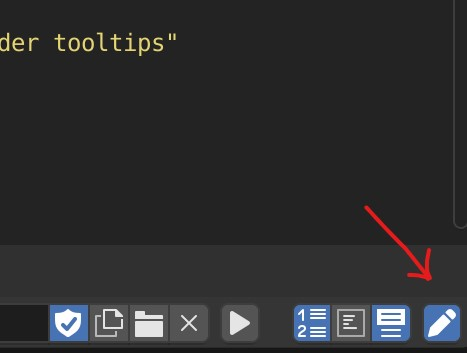
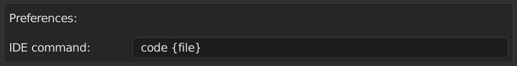

# Open Blender scripts in a text editor

This is a Blender addon that let's you edit blender scripts in your IDE of choice, with edits being reflected back in the Blender text editor every time you save the file:

The addon creates a temporary file that contains the current blender scripts contents, so that it can be opened by an IDE.

# Installation

Download the file named `"open_with_ide.py"` (click on the file, then the "raw" button and then save page as) and install it just like any other Blender addon.

# Usage

To use the addon, open a text file in the blender text editor, and in the header, click the button on the very right with the icon of a pencil:

<!--  -->

The script will then be opened in the IDE, and all changes made in either program will be reflected in the other.

By default, the addon will open the script in VSCode, but you can change that in the preferences by changing the "ide command" setting:

